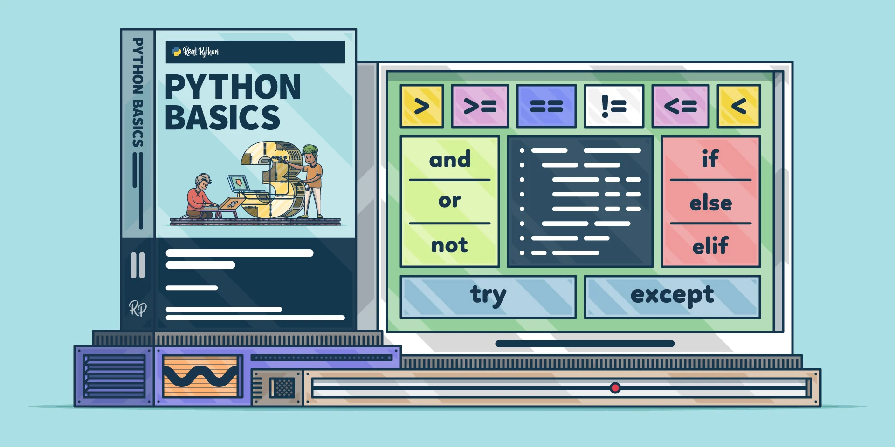

# Python Control Flow Lab

## Setup and Instructions
1. Fork and clone this repo to your local machine.
1. Open the `app.py` file for the exercises that you will be working on.
1. Add your solution below each exercise's prompt.
1. After completing each exercise, you may comment out that exercise's code to ease completion of subsequent exercises.
1. Before submitting, uncomment ALL solutions.

## Solutions
Check the solutions branch if you're stuck. Do your best not to peek until you have to!

## Licensing
1. All content is licensed under a CC­BY­NC­SA 4.0 license.
2. All software code is licensed under GNU GPLv3. For commercial use or alternative licensing, please contact legal@ga.co.
